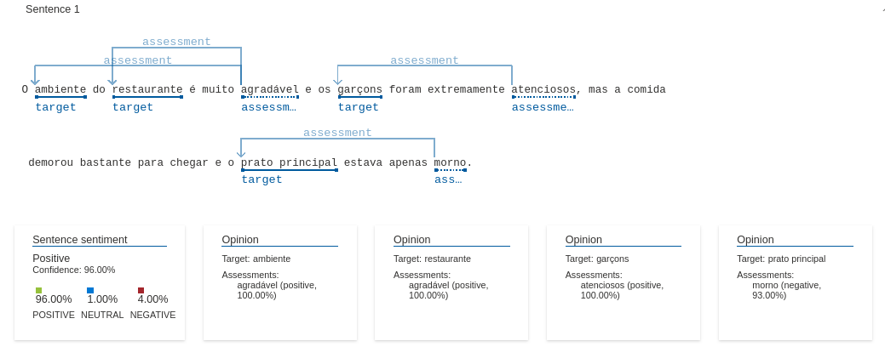
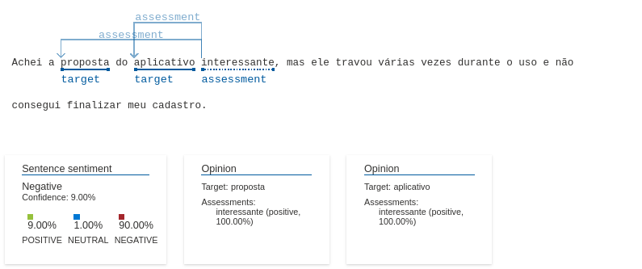
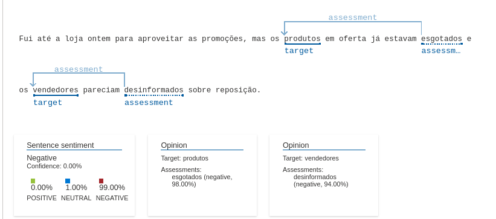

# 🚀 Análise de Texto com IA do Azure

Este repositório contém um pequeno experimento utilizando os serviços de Processamento de Linguagem Natural (PLN) da **IA do Azure** para extrair insights de diferentes tipos de textos.  

A ideia foi testar a **Análise de Sentimento e Mineração de Opiniões**, processando frases que poderiam ser encontradas no dia a dia de consumidores e empresas.

---

## Como foi feito?

1. **Criação do repositório** com uma pasta `inputs/` contendo frases simuladas sobre experiências de clientes.
2. **Envio das frases para análise da IA do Azure** usando o **Language Studio**.
3. **Captura dos resultados** e interpretação dos dados, incluindo:
   - Classificação do **sentimento geral** (positivo, neutro ou negativo).
   - Extração de **palavras-chave** e **opiniões específicas**.
   - Identificação de **pontos positivos e negativos** nas frases.
4. **Documentação e prints** dos resultados neste repositório.

---

## Resultados e Insights

Abaixo estão alguns exemplos de frases analisadas e seus resultados:

### 1 Avaliação de um Restaurante 🏨 🍽️  
**Frase:**  
*"O ambiente do restaurante é muito agradável e os garçons foram extremamente atenciosos, mas a comida demorou bastante para chegar e o prato principal estava apenas morno."*  

 **Pontos positivos:**  
- Ambiente **agradável** (100% positivo)  
- Garçons **atenciosos** (100% positivo)  

 **Ponto negativo:**  
- **Prato principal morno** (93% negativo)  

 **Sentimento geral:** **Positivo (96%)**, apesar da crítica à comida.

---

### 2 Experiência com um Aplicativo 
**Frase:**  
*"Achei a proposta do aplicativo interessante, mas ele travou várias vezes durante o uso e não consegui finalizar meu cadastro."*  

 **Ponto positivo:**  
- Proposta do app considerada **interessante**  

 **Pontos negativos:**  
- Travamentos frequentes  
- Problemas no cadastro  

 **Sentimento geral:** **Negativo (90%)**, pois a falha técnica prejudicou a experiência do usuário.

---

### 3 Problemas em Loja Física 
**Frase:**  
*"Fui até a loja ontem para aproveitar as promoções, mas os produtos em oferta já estavam esgotados e os vendedores pareciam desinformados sobre reposição."*  

 **Pontos negativos:**  
- Produtos **esgotados** (98% negativo)  
- Vendedores **desinformados** (94% negativo)  

 **Sentimento geral:** **Negativo (99%)**, pois a experiência do cliente foi frustrante.

---

## O que aprendemos com isso?

- A **IA do Azure** consegue extrair opiniões específicas dentro de uma frase, analisando o contexto.
- Mesmo frases com **elogios e críticas misturadas** são bem interpretadas pela análise de sentimentos.
- Empresas podem usar essa ferramenta para **entender melhor a experiência dos clientes** e melhorar seus serviços.

---

